# Функциональное тестирование программного продукта «БиблиоТэка»

## 3. Функциональное тестирование

Функциональное тестирование программного продукта «БиблиоТэка» проводилось путём последовательного обхода всех компонентов пользовательского интерфейса с целью верификации соответствия реализованной функциональности заявленным требованиям. Тестирование охватывает полный пользовательский путь — от первого посещения платформы неаутентифицированным пользователем до освоения расширенных возможностей системы после прохождения процедуры регистрации и авторизации.

---

### 3.1 Главная страница (неаутентифицированный пользователь)

При первом обращении к платформе пользователь видит главную страницу, оформленную в минималистичном стиле (Рисунок 3.1). В верхней части интерфейса располагается навигационная панель, содержащая логотип «БиблиоТэка», ссылки на основные разделы («Главная», «Каталог», «Форум»), а также элементы управления персонализацией: кнопку выбора акцентного цвета и переключатель цветовой темы. В правом верхнем углу размещена кнопка «Войти», обеспечивающая переход к странице аутентификации.

Центральная область главной страницы содержит брендинговый блок с наименованием платформы и её кратким описанием, а также кнопку «Подробнее о нас», ведущую на информационную страницу проекта. Ниже располагаются тематические секции каталога: «Популярные книги», «Новинки» и «Рекомендовано вам», каждая из которых представляет книжные карточки в сеточном формате с указанием названия, автора, года издания, рейтинга и жанровых тегов. Справа от заголовка каждой секции находится кнопка «Все», перенаправляющая пользователя в полный каталог.

В нижней части страницы расположен футер, содержащий сведения об авторских правах и ссылки на документы «Политика конфиденциальности», «Условия использования» и «Помощь».

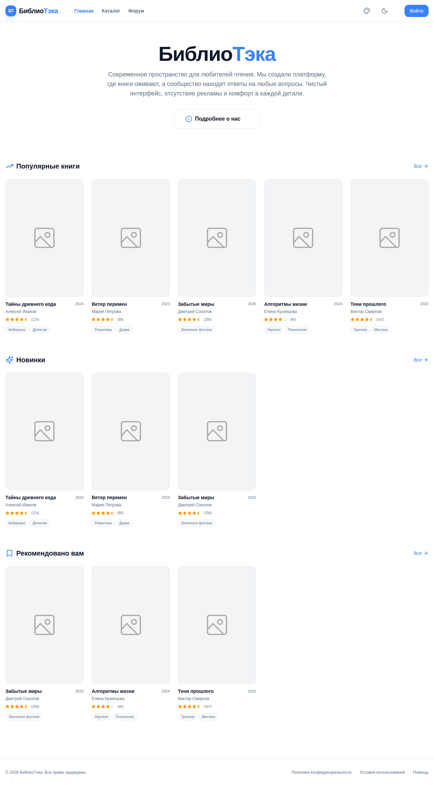

**Рисунок 3.1 — Главная страница (неаутентифицированный пользователь)**

---

### 3.2 Каталог книг

При переходе в раздел «Каталог» пользователю открывается страница просмотра книжного фонда платформы (Рисунок 3.2). Интерфейс каталога включает поисковую строку с плейсхолдером «Поиск по названию, автору или жанру...», позволяющую осуществлять мгновенную фильтрацию отображаемых изданий по введённому запросу. В правом верхнем углу контентной области располагаются переключатели режима отображения: сеточный вид (по умолчанию) и списочный вид. Книжные карточки в сеточном режиме содержат обложку, название, автора, год издания, агрегированный рейтинг и жанровые теги. Реализован механизм бесконечной прокрутки: при достижении конца страницы система автоматически подгружает дополнительные записи.

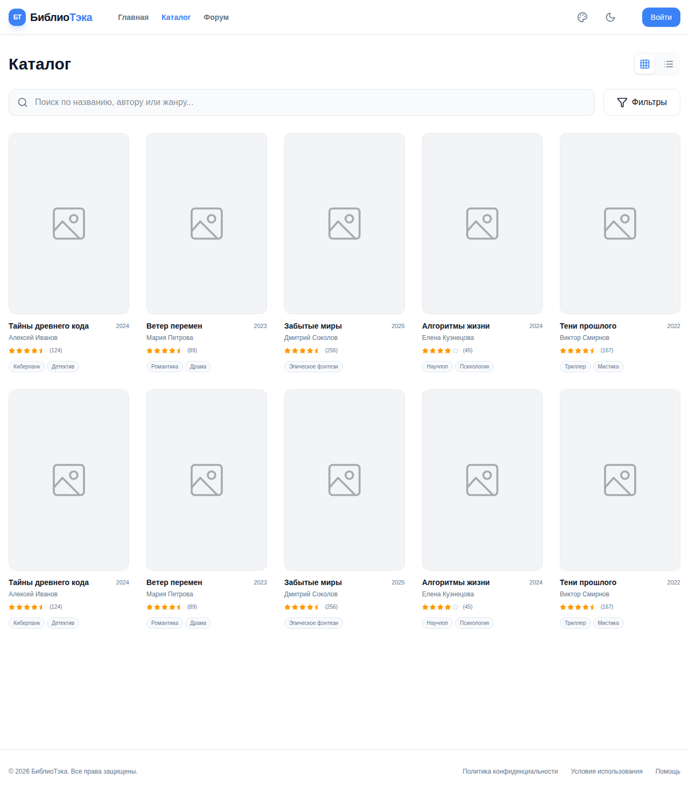

**Рисунок 3.2 — Страница каталога (сеточный режим)**

При нажатии на кнопку «Фильтры» раскрывается панель расширенной фильтрации (Рисунок 3.3), содержащая две группы элементов управления. Первая группа — «Жанры» — представляет собой набор кнопок-тегов, активация которых ограничивает выборку книгами соответствующего жанра (доступны варианты: «Все», «Фантастика», «Фэнтези», «Проза», «Детектив», «Триллер», «Образование», «Психология»). Вторая группа — «Сортировка» — предоставляет выпадающий список с вариантами упорядочивания результатов: по популярности, по новизне, по рейтингу. Выбранный жанровый фильтр визуально выделяется акцентным цветом.

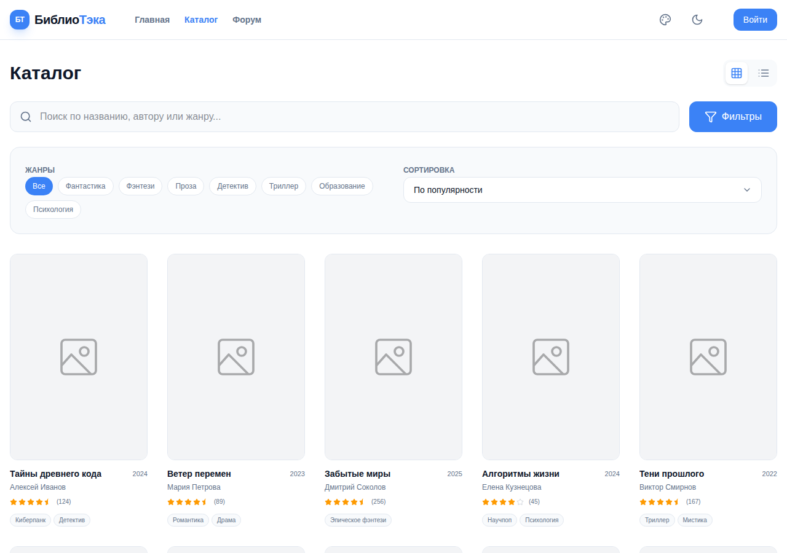

**Рисунок 3.3 — Панель фильтров каталога**

---

### 3.3 Страница книги

При нажатии на карточку книги в каталоге или на главной странице осуществляется переход на детальную страницу конкретного издания (Рисунок 3.4). Левая панель страницы содержит обложку книги в увеличенном формате, основные кнопки действий («Читать книгу», «В избранное», «Поделиться») и информационный блок с метаданными: год издания, жанр и возрастное ограничение. Кнопка «В избранное» доступна только аутентифицированным пользователям; для неаутентифицированных она отображается с пониженной непрозрачностью и помечена как недоступная.

Правая часть страницы представляет содержательный блок: название книги, имя автора, числовой рейтинг со звёздочной визуализацией, количество отзывов и жанровые теги. Ниже располагается система вкладок: «О книге», «Отзывы», «Комментарии». По умолчанию активна вкладка «О книге», отображающая аннотацию и блок рекомендаций «Почему стоит прочитать?» со списком достоинств издания.

**Рисунок 3.4 — Страница книги (вкладка «О книге»)**

При переключении на вкладку «Отзывы» (Рисунок 3.5) аутентифицированному пользователю предоставляется форма публикации собственного отзыва, включающая интерактивный механизм выставления звёздочной оценки (от 1 до 5) и текстовое поле для ввода рецензии. Под формой отображается список существующих отзывов с указанием имени рецензента, аватара, даты публикации и выставленной оценки. Для каждого отзыва реализованы кнопки оценки его полезности («лайк» / «дизлайк»), доступные только зарегистрированным пользователям.

**Рисунок 3.5 — Страница книги (вкладка «Отзывы»)**

---

### 3.4 Страница аутентификации

Для получения доступа к персональным функциям платформы пользователю необходимо пройти процедуру аутентификации. При нажатии на кнопку «Войти» в навигационной панели осуществляется переход на страницу входа (Рисунок 3.6). Форма входа содержит поля для ввода адреса электронной почты и пароля, а также ссылку «Забыли пароль?» для восстановления доступа к учётной записи. После заполнения полей пользователь нажимает кнопку «Войти»; на период обработки запроса кнопка блокируется и отображает анимированный индикатор загрузки, что обеспечивает визуальную обратную связь о статусе операции. В нижней части формы располагается защитный индикатор «Безопасное соединение БиблиоТэка», подтверждающий применение защищённого протокола передачи данных.

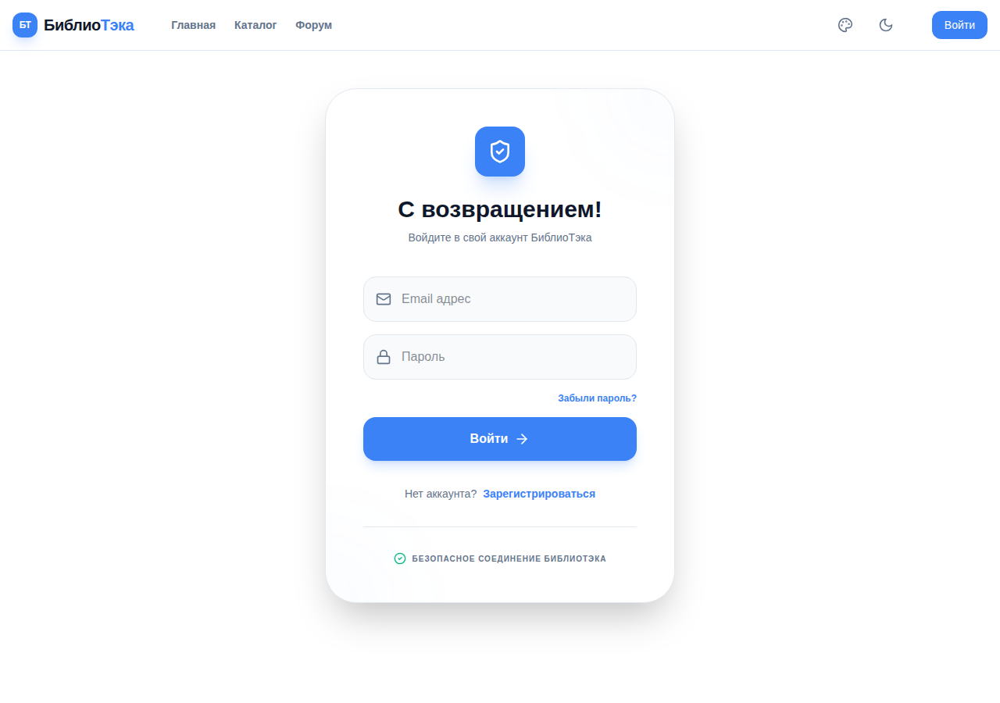

**Рисунок 3.6 — Страница входа в систему**

При необходимости создания новой учётной записи пользователь нажимает ссылку «Зарегистрироваться», после чего форма переключается в режим регистрации (Рисунок 3.7). В данном режиме к стандартным полям добавляется поле для ввода имени пользователя, а кнопка подтверждения меняет надпись на «Создать аккаунт». Переключение между режимами входа и регистрации реализовано с применением анимации раскрытия/скрытия дополнительного поля.

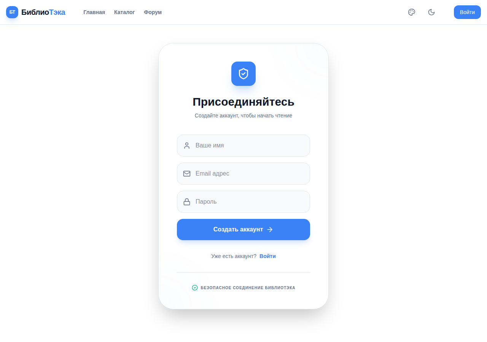

**Рисунок 3.7 — Страница регистрации учётной записи**

---

### 3.5 Главная страница (аутентифицированный пользователь)

После успешного входа в систему пользователь перенаправляется в свой профиль, а при последующем переходе на главную страницу интерфейс существенно расширяется (Рисунок 3.8). В навигационной панели появляются ссылки «Профиль», «Админка» (для пользователей с административными правами) и кнопка выхода из системы. В основной области главной страницы, над секциями книг, появляется персональный блок «Продолжить чтение», содержащий информацию о последней читаемой книге: её название, указание главы, на которой пользователь остановился, краткую аннотацию, прогресс-бар с визуализацией процента прочитанного, кнопку «Читать дальше» и обложку книги.

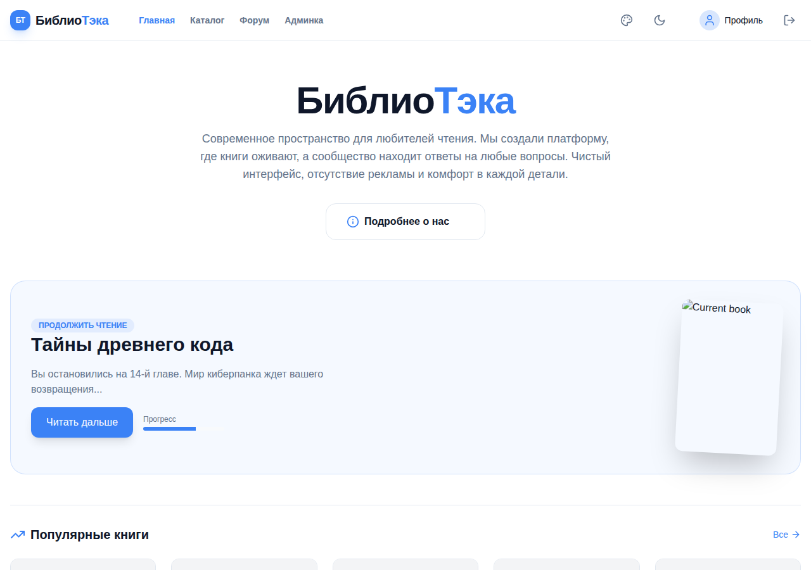

**Рисунок 3.8 — Главная страница (аутентифицированный пользователь)**

---

### 3.6 Страница профиля

Страница профиля пользователя (Рисунок 3.9) организована в виде двухколоночного макета. В верхней части располагается баннер профиля с возможностью замены изображения через всплывающую кнопку редактирования, появляющуюся при наведении курсора. Поверх баннера расположен аватар пользователя с аналогичным механизмом замены. Рядом с аватаром отображаются имя пользователя и адрес электронной почты, а также кнопка «Редактировать», активирующая режим инлайн-редактирования данных учётной записи.

Левая боковая панель содержит блок статистики с показателями количества прочитанных книг, средней выставленной оценки и форумной активности, а также блок «О себе» с биографической информацией пользователя и возможностью её редактирования. Правая основная область организована с помощью системы вкладок: «Избранное» (сетка добавленных в избранное книг), «Мои отзывы» (список опубликованных рецензий с возможностью их редактирования и удаления), «История» (хронология прочитанных книг с прогресс-барами), «Безопасность» (форма смены пароля).

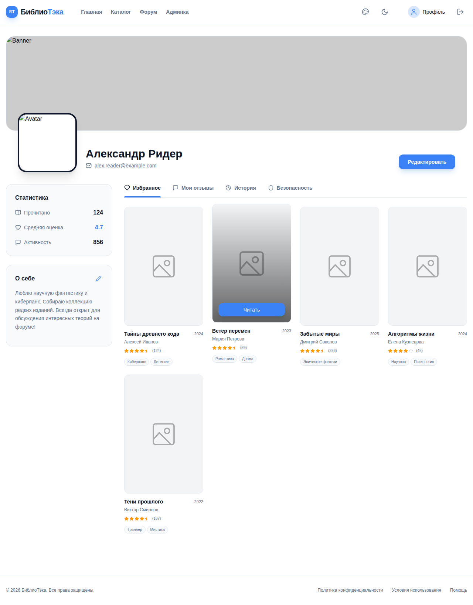

**Рисунок 3.9 — Страница профиля пользователя**

---

### 3.7 Форум

Раздел «Форум» предоставляет пространство для тематического обсуждения книг и общения участников платформы (Рисунок 3.10). Страница форума организована в двухколоночном макете: основная часть содержит список тематических обсуждений, правая боковая панель — поисковую строку по темам и облако популярных тегов («Теории», «Спойлеры», «Поиск книг», «Конкурсы», «Оффтоп»). Каждая тема в списке отображает заголовок, количество ответов, время последней активности и категориальный тег. Закреплённые темы помечаются иконкой булавки с жёлтой подсветкой и выводятся в верхней части списка. Заблокированные темы отмечаются иконкой замка. Реализован механизм бесконечной прокрутки для подгрузки дополнительных тем.

Для аутентифицированных пользователей в правом верхнем углу контентного блока отображается кнопка «Новая тема», открывающая модальное окно создания обсуждения. Пользователям с административными правами при наведении на тему становятся доступны кнопки закрепления/открепления и удаления темы.

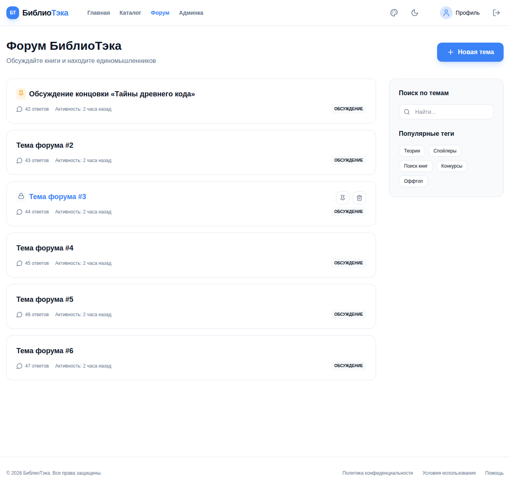

**Рисунок 3.10 — Страница форума**

При переходе внутрь темы открывается страница обсуждения (Рисунок 3.11), отображающая список сообщений участников. Каждое сообщение содержит аватар и имя автора, его роль на платформе (участник или модератор), дату и время публикации, текст сообщения, а также интерактивные кнопки реакции «лайк» и «дизлайк» с отображением счётчиков. Аутентифицированные пользователи могут воспользоваться кнопкой «Ответить», раскрывающей форму ответа на конкретное сообщение. В нижней части страницы располагается общая форма публикации ответа в теме. Вверху страницы имеется кнопка возврата к списку тем форума.

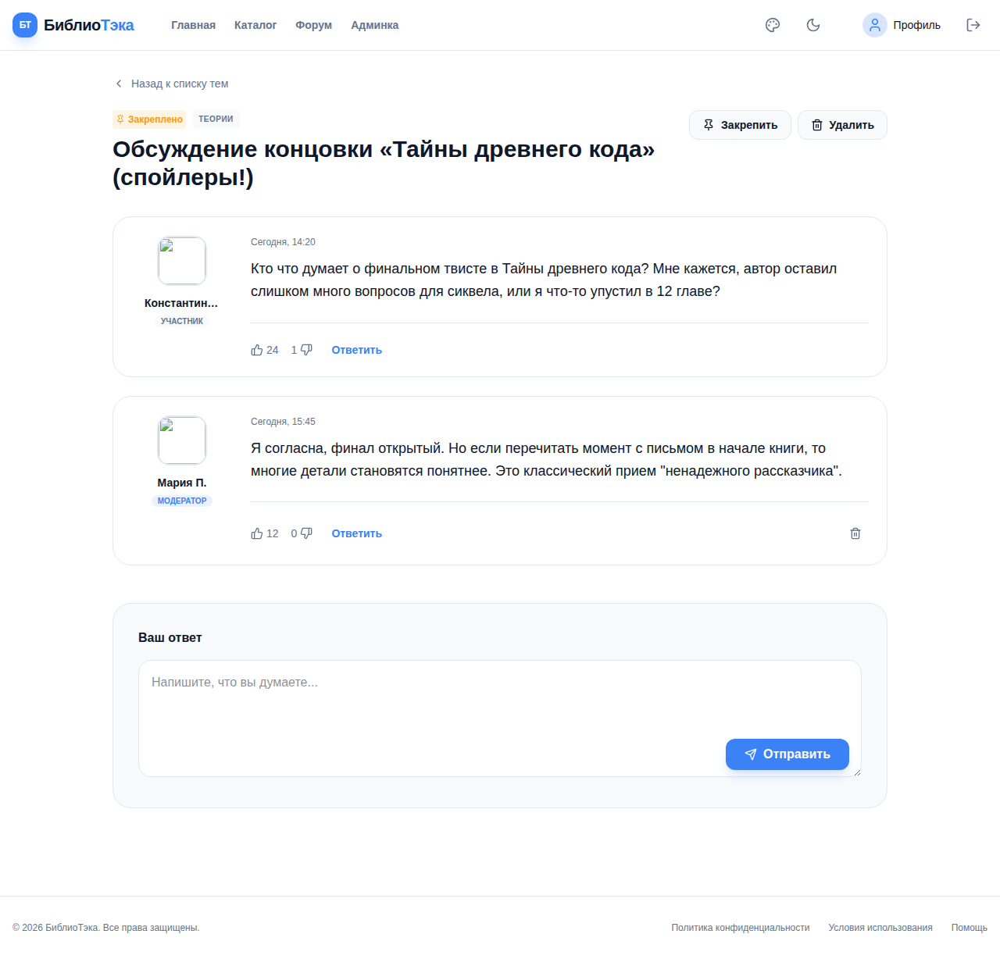

**Рисунок 3.11 — Страница темы форума**

---

### 3.8 Встроенный ридер

Нажатие на кнопку «Читать книгу» на странице книги или «Читать дальше» в блоке продолжения чтения открывает встроенный ридер (Рисунок 3.12). Интерфейс ридера реализован как полноэкранное представление поверх основного контента приложения. Верхняя панель содержит кнопку возврата, название книги и текущей главы, а также кнопки вызова настроек, содержания и активации режима фокусировки. Нижняя панель отображает текущую и общую страницы, прогресс-бар чтения и кнопки навигации по страницам, а также возможность добавления закладки.

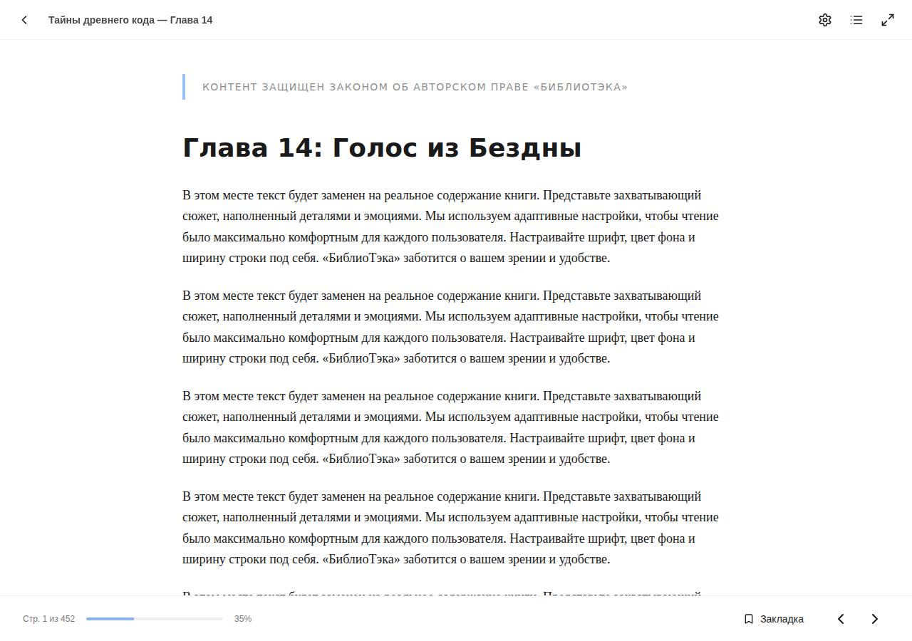

**Рисунок 3.12 — Встроенный ридер**

При нажатии на кнопку настроек в правой части экрана появляется панель персонализации параметров чтения (Рисунок 3.13). Настройки включают три параметра. Первый — «Тема» — предоставляет выбор из трёх вариантов цветового оформления: «День» (белый фон, тёмный текст), «Бумага» (сепия-фон, коричневый текст) и «Ночь» (тёмно-синий фон, светлый текст). Второй — «Размер шрифта» — реализован в виде слайдера в диапазоне от 12 до 32 пикселей с кнопками пошагового изменения «A−» и «A+». Третий — «Ширина строки» — предлагает варианты «Узкая», «Средняя» и «Широкая».

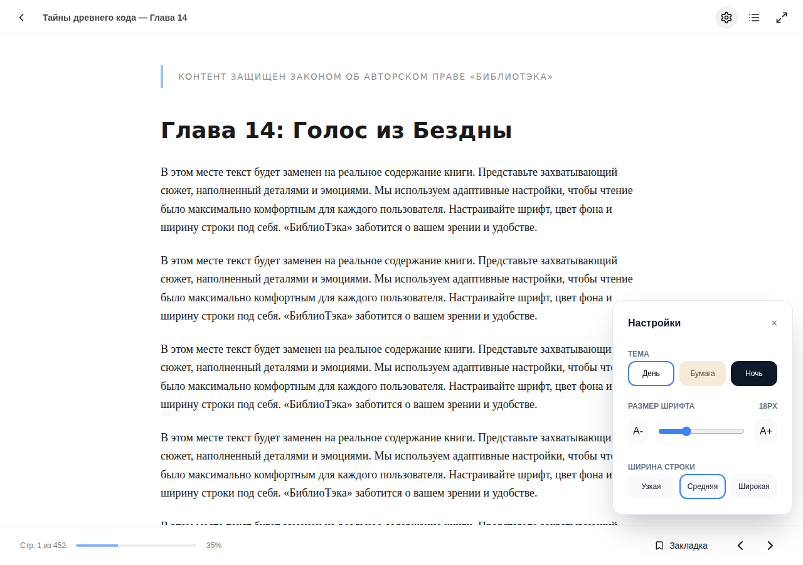

**Рисунок 3.13 — Настройки ридера**

---

### 3.9 Панель администратора

Пользователям с административными правами доступна панель управления платформой (Рисунок 3.14), переход к которой осуществляется через пункт «Админка» в навигационном меню. Интерфейс панели организован с помощью системы вкладок: «Статистика», «Библиотека», «Пользователи» и «Настройки».

Вкладка «Статистика» (отображается по умолчанию) содержит четыре сводных показателя: общее количество книг в системе, количество зарегистрированных пользователей, суммарное число комментариев и общее количество прочтений. Ниже расположены графические блоки: столбчатая диаграмма активности пользователей по дням недели, горизонтальные полосы с распределением книг по жанрам, а также гистограмма статистики прочтений за текущий месяц. В правом верхнем углу страницы располагается кнопка «Добавить книгу», открывающая форму добавления нового издания в каталог.

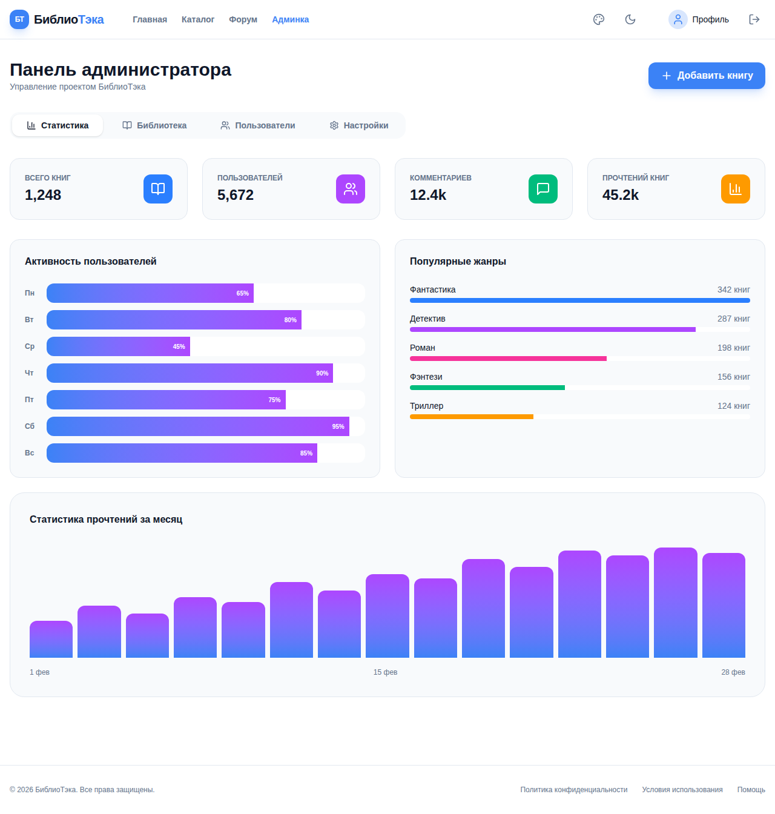

**Рисунок 3.14 — Панель администратора (вкладка «Статистика»)**

---

### 3.10 Персонализация интерфейса

Платформа «БиблиоТэка» предоставляет пользователю возможности персонализации визуального оформления интерфейса, доступные вне зависимости от статуса аутентификации. В навигационной панели расположены два соответствующих элемента управления.

Переключатель цветовой темы (иконка луны/солнца) обеспечивает мгновенное переключение между светлым и тёмным режимами отображения. Переход сопровождается плавной анимацией изменения цветовых переменных.

Кнопка «Выбор акцента» (иконка палитры) раскрывает всплывающую панель с набором цветовых сфер, позволяя пользователю выбрать акцентный цвет интерфейса. Выбранный цвет применяется к активным элементам навигации, кнопкам действий, прогресс-барам, подчёркиваниям активных вкладок и прочим акцентным элементам по всему интерфейсу.

---

### 3.11 Итоги функционального тестирования

В ходе функционального тестирования программного продукта «БиблиоТэка» была верифицирована корректность работы всех основных компонентов пользовательского интерфейса: главной страницы, каталога с поиском и фильтрацией, страницы книги с системой вкладок и отзывов, страницы аутентификации с переключением режимов входа и регистрации, профиля пользователя, форума и тематических обсуждений, встроенного ридера с настройками, панели администратора, а также механизмов персонализации интерфейса. Все перечисленные функциональные элементы продемонстрировали поведение, соответствующее проектным требованиям.
